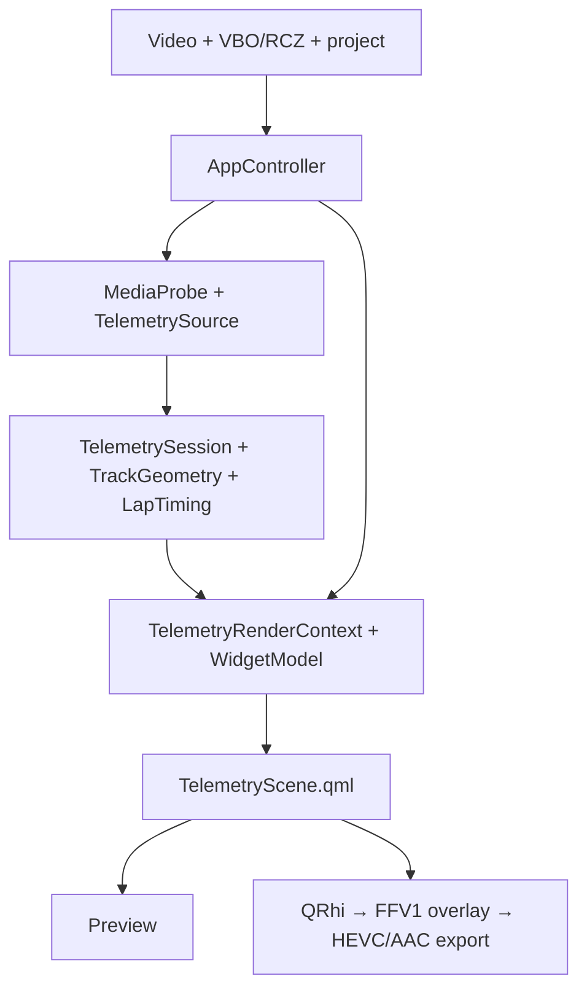

# Architecture

FlappedEar Overlays (renamed from FlappedEar Telemetry by KAN-125) is a native Qt 6 application for overlay editing and generation. Its analysis window, workflows and day import were removed by KAN-166 (approved and done on 5 October 2026): the editor header picks a day's run, and days come from FlappedEar Telemetry. By owner decision (2 October 2026) it is being split into a desktop overlay editor (macOS and Windows) and the FlappedEar Telemetry app (macOS, Windows, iOS and Android), a new Flutter app in its own repository that shares no code with this one (Jira epic KAN-165, decision KAN-167). The library structure below remains this repository's architecture and the behavioural reference for that app ([architect handover](telemetry-handover.md)), and both apps keep one compatible `.fetproject` format (KAN-170). C++ owns telemetry, media, project, synchronization, and export behavior; QML presents the editor and the reusable telemetry scene.

The [product vision](product-vision.md) defines the full intended analytical workflow;
the [delivery plan](product-delivery.md) distinguishes implementation from remaining
work and acceptance. This document describes the current module boundaries.

## Libraries (KAN-123)

The code builds as three static libraries. This is the first step of the
product split (`docs/product-split-plan.md`, epic KAN-121, now KAN-165):

- **`flappedear_telemetry_core`** holds `src/telemetry` and `src/project`:
  parsers, lap timing, compatibility, segments, sector timing, theoretical
  best, time loss, consistency, variability, G-G pairs, channel summaries
  and cooling, the computed day report (`DayReport`, KAN-71), the event
  document and recovery. It links **Qt Core and zlib only**, so it can be built for
  all four target platforms, including iOS and Android. The `flappedear_telemetry_core_boundary` test fails if a
  file there reaches, directly or through other headers, a project file outside the
  library's own sources, or a Gui header. Video
  fingerprints are built on the overlay side (`export/VideoFingerprint`)
  from the document layer's video-free helpers. An event (v3) document may
  omit the overlay `scene` (an analysis-only day); a scene that is present
  must still be valid.
- **`flappedear_telemetry_app`** (KAN-124) holds the Telemetry app's
  controllers:
  - `DocumentController` and `AnalysisController`;
  - `TelemetryController`, which pairs them with no editor, no video and
    no export. Since KAN-166 step 5 it is the only owner of an
    `AnalysisController`; Overlays' `AppController` uses `DocumentController`
    and `BestLapFinder` only;
  - `AppLog`.

  It links the telemetry core with **Qt Core and Concurrent only** (no
  Gui). The `flappedear_telemetry_app_boundary` test fails if these files
  reach a project file outside this library and the core, or a Gui header.
  `flappedear_telemetry_app_tests` drives a whole day through
  `TelemetryController` with `QTEST_GUILESS_MAIN`: import, laps, segments,
  the day report, save and reopen.
- **`flappedear_overlay_core`** holds export (FFmpeg, the QRhi frame
  renderer), GoPro, widgets and the editor's app support. Synchronization
  moved to telemetry core in KAN-101.
  It links the telemetry app and core plus Qt Gui, Qml, Quick and
  GuiPrivate.
- `flappedear_core` is an interface target over all three. The current
  combined application and its app-level tests use it. Pure test targets
  link only `flappedear_telemetry_core`.
- **`flappedear_editor`** (KAN-161) holds `AppController`, the editor's QML
  facade, and `BundledFonts`. The application and the five
  `flappedear_native_tests_*` suites link it, so these sources compile once.

The editor reads what it needs for laps and charts from the core and the
document, not from `AnalysisController` (KAN-166 step 1): the lap-exclusion
binding comes from `EventProjectCodec::primaryTelemetryBinding`, chart
series from `telemetry/ChannelSeries`, and lap-time text from
`formatElapsedTime` in `telemetry/LapTiming`. Editor tests resolve QML
through `QML_SOURCE_DIR`, not through analysis file paths.
Since step 2 the editor writes no analysis data on its own: it no longer
approves automatic segments, and it saves `analysis.channels` as loaded
as it was loaded; since step 3 nothing can change them.

## Application

`AppController` is the QML-facing application boundary. It exposes source state, playback time, synchronization, live values, project dirty state, loading state, export state, analysis state, and the `WidgetModel`. It also owns the preview `TelemetryRenderContext`, so QML reads telemetry through one time transform rather than parsing files itself.

**Split boundary (KAN-124, closed 27 September 2026).** The analysis code (day import,
outing laps, comparison, segment review, Corner Analyzer, theoretical best,
losses, report) reaches video only through `VideoLink` (`src/app/VideoLink.h`):
- "video position for this run's telemetry time";
- "telemetry time for this video position".

Both are empty when the run has no loaded video or the time falls outside
it. `AppController` implements it for the combined app. The Telemetry app
will have no link, and then the KAN-39 lap video is simply unavailable.
Analysis and import guards use `documentBusy()` (today: an export is
running) instead of the overlay's `exporting()`. `loadOutingLapDetail`
(`telemetry/OutingLapLoader`) moved into telemetry core. It loads and
verifies one recorded section for the lap view, the comparison, the
theoretical best and the channel summaries, so both apps share it. The
channel-summary worker (`summarizeOutingChannels`, `channelSummaryMap` in
`telemetry/OutingChannelSummaries`) is also in core. It computes
temperatures, trends, cooling and heart rate per run and section. So is
the theoretical-best worker (`calculateOutingTheoreticalBest` in
`telemetry/OutingTheoreticalBest`). It gives every eligible lap's sector
times on the canonical axis, the theoretical and actual best, and the
per-corner observations. Lap derivation also moved to core
(`deriveOutingLaps`, `outingSourceDependencyKey` in
`telemetry/OutingLapDerivation`). It resolves, bounds and verifies every
run's recording, reuses unchanged runs, and infers and groups tracks. Core
now runs the day analysis without application code:
`OutingPipelineTests` links only `flappedear_telemetry_core`. The day
report is assembled in core too (`buildOutingDayReport` in
`telemetry/OutingDayReport`), from the computed results, the decisions
keys and the focus inputs. `AppController` only gathers them. The
theoretical-best family's published forms are in core as well
(`telemetry/OutingTheoreticalBestResults`):
- `publishTheoreticalBest`;
- `publishTimeLossRanking`;
- `publishSectorProgression`;
- `rankOutingTimeLosses`.

They work from the single committed `OutingTheoreticalBest` result the
controller keeps.

`AnalysisController` (`src/app/AnalysisController.h`) owns the day's
analysis state:
- outing laps and lap detail;
- segment review and the Corner Analyzer;
- the comparison;
- theoretical best, losses and section progression;
- channel summaries and the day report.

It sees the project only through `AnalysisDocument`
(`src/app/AnalysisDocument.h`). That interface lets it:
- read the project;
- commit a validated edit;
- check whether an edit is allowed now (loading, busy, recovery, batch
  import, pending destructive action);
- read the source generation and the active run.

`DocumentController` (`src/app/DocumentController.h`) owns the project
document:
- the saved project, its identity and revisions, and dirty state;
- recovery;
- new, open, save and quit decisions;
- run selection and day import (day import is reached only through
  `TelemetryController` since KAN-166 step 6; Overlays has no import UI).

It implements `AnalysisDocument`. Whatever the application adds comes
through `DocumentHost` (`src/app/DocumentHost.h`):
- source generations, and the editor state stored in the project (the
  active run's sources, synchronisation, overlay scene and chart
  channels);
- the verified analysis a saved project carries;
- whether the document is busy (an export).

`TelemetryController` hosts a document without an editor. Its project keeps
the editor state another app saved. On Save As it rebases the active run's
recording and video references for the new folder, as the editor does.

`AppController` implements `DocumentHost` and `VideoLink` and forwards its
QML API unchanged. It still applies lap exclusions to the editor's own lap
navigation when analysis re-applies them. A separate OverlayController was
not extracted: KAN-124 closed with `AppController` holding only the overlay
editor plus `DocumentHost`/`VideoLink` and forwarding.

KAN-215 splits the rest of `AppController` into controllers it owns. Step 2
moved the export run into `ExportController` (`native/src/app/ExportController.h`),
which QML reaches as `appController.exporter`. `AppController::startExport` still
gathers the job (sources, chapters, protected paths, lap binding, scene and
synchronization) and hands it with the dialog's request to
`ExportController::start`, which validates it, prepares the output transaction
and its manifest, runs and supervises the worker, follows its progress and
diagnostics, and commits or cleans up. Status lines and the quit after a
cancelled export come back to `AppController` as signals.

Step 3 moved synchronization into `SyncController` (`appController.sync`): the
transform (offset and time scale), the auto-sync worker and its candidate, and
the rule that a timing edit cancels a running auto-sync and rejects its result.
`AppController::autoSync` checks that a video and telemetry are open and passes
the sources the result must still match. A user edit reaches `AppController` as
`edited()`, which updates the preview's transform and marks the document dirty;
a project's saved transform is restored without marking it.

Step 4 moved the template picker into `TemplatePicker` (`appController.templatePicker`):
the selected template, kept across launches, and the active template the scene was
applied from, the only one "Update template" may overwrite. Opening a project or
closing the editor clears the active template and keeps the selection.

Step 5 moved the preview timeline into `PreviewTimeline` (`native/src/app/PreviewTimeline.h`):
the preview viewport, where playback starts and ends, how a seek is clamped and
the SMPTE timecode for a position. A chaptered video is one timeline of its whole
duration at the first chapter's rate. `AppController` builds one from the opened
source per call and keeps its QML properties unchanged.

Step 6 moved what the export dialog offers into `ExportSourceOptions`
(`native/src/app/ExportSourceOptions.h`): the source summary, the size and frame
rate choices, the recommended bitrate, and the frame ranges for the whole video,
a typed range or a lap with handles. `AppController::lapExportRange` still finds
the lap and maps it to video time through the sync transform.

Editor chrome keeps one vertical scroll surface for the complete left sidebar and independent explicit scroll extents for each inspector tab, so no controls are unreachable at the 1180×720 minimum window size. Playback transport is centralized on the primary `MediaPlayer`; the Analysis window forwards the same keyboard seeks and play/pause action to it, and full-screen presentation uses that player and timeline rather than a second transport state. Text, numeric, and focused interactive controls suppress playback shortcuts. Qt decoder failures stop the affected player, enter the application log/status boundary, and remain visible over both the editor preview and Analysis video pane.

## Project

`ProjectDocumentState` tracks the current project path, revision, saved revision, and a pending destructive action. New, open, and quit therefore require a decision when the document is dirty.

`ProjectWriter` saves serialized `.fetproject` data through `QSaveFile` with direct-write fallback disabled. Before reaching it, `AppController` applies the same structural limits used by load and checks the final serialized 4 MiB bound. A project is marked saved only after validation and the atomic write commit.

The saved `.fetproject` is the authoritative clean document. `AppController` retains its complete JSON object as the serialization base and overlays known edits onto nested project objects, so unknown or future fields survive open/edit/save cycles. Current saves persist a document identity and saved revision in `documentState`; Save/Save As updates that base and revision before best-effort recovery cleanup. A failed project write leaves both dirty state and recovery intact.

Persistent unsaved edits are serialized as one complete project object plus recovery v2, document identity, original project path, timestamp, and revision metadata. `ProjectRecoveryStore` atomically replaces `project-recovery.json` under `AppLocalDataLocation` through `QSaveFile`; a restartable 250 ms single-shot debounce coalesces persistent edit bursts. Playback position, Analysis-window visibility, and other transient UI state do not trigger it. Recovery-write failure is logged, exposes `recoveryDegraded` plus an error to QML, presents a non-modal manual-save warning, and retries after a five-second backoff or the next edit. A later success clears the degraded state; it never modifies the saved project. Failure to delete an already superseded snapshot is only logged cleanup debt: it does not set `recoveryDegraded` or show a warning.

QSettings is application preference storage, not document storage. It retains window and analysis-window geometry and the last project path. Legacy QSettings document keys under `editor/widgets`, `sync/*`, `sources/*`, and `analysis/*` are deleted and are never reconstructed as a clean document. Analysis channel configuration remains project content; floating-window visibility does not.

On a clean startup, v2 recovery is compared logically with the remembered or original saved authority. A matching authority at the same or newer revision makes the snapshot stale; startup suppresses the dialog and retries cleanup. A newer matching snapshot is valid and waits for an explicit Recover/Discard choice. Identity-mismatched or malformed v2 recovery is invalid and never applied. Legacy v1 recovery remains conservatively recoverable. The remembered `.fetproject` otherwise opens through the ordinary transactional loader; if it is missing, the path is forgotten and a default new document is used. For a user discard, `ProjectRecoveryStore` first atomically writes a sibling `.discard` tombstone keyed by document identity and discarded-through revision; then Quit, Open, New, or startup Discard may continue even if snapshot deletion fails. Startup suppresses only a matching v2 snapshot at or below that bound, retries cleanup, and removes the tombstone after cleanup succeeds. A failed tombstone write cancels discard only when snapshot deletion also fails; these cleanup paths never change `recoveryDegraded`.

Project open first performs bounded file reading, JSON parsing, and structural validation (version, widget scene, synchronization, analysis settings, and source-reference structure) on the project-load worker. It then commits that complete document atomically before resolving external assets. The validated-result continuation starts video and telemetry only when applying the widget scene succeeds; failure leaves the prior document and its sources untouched. A missing, mismatched, or invalid asset after a successful document commit changes only its source state and never rolls back the document, widgets, synchronization, or settings.

`ProjectSourceReferenceCodec` owns the v2 source-reference migration, project-relative resolution, absolute fallback, serialization, and lightweight fingerprints. The current schema and compatibility rules are in [project-format.md](project-format.md).

Event projects use the development v3 schema and `EventProjectCodec`: one event
contains stable run/source identities, one primary telemetry source per run,
optional alternatives, and run-local video references and synchronization.
The selected run is projected into the existing editor interface; saves fold its
state back into the authoritative event and preserve inactive runs. Ordinary v2
single-recording projects remain supported. See [event project format](event-project-format.md)
for save/recovery/relink behavior and limits. Lap rows carry their owning run;
derived lap numbers are not permanent annotation identities across source or gate changes.

## Source loading

Video metadata probing uses `MediaProbe`/`ffprobe`; `TelemetrySource::load` dispatches VBO/RCZ and parses telemetry and builds `TrackGeometry`. Standalone loads, resolved project sources, and relink candidates run asynchronously. Their independent states are `idle`, `loading`, `ready`, `missing`, `mismatch`, or `error`. A relink candidate is probed/parsed before commit; a fingerprint mismatch is held outside committed state until the user explicitly accepts replacement.

Each source operation begins a new source generation and uses normalized source identities: cleaned absolute paths, or canonical paths when available. Results carry their generation and are ignored if a newer operation has started or identities no longer match. All long-running source work receives the same lightweight `CancellationCheck` callback and throws `OperationCancelled` on cancellation. VBO/RCZ reads/parsing, media probes, GoPro packet indexing/reads/decoding, and both coarse and fine synchronization check it in bounded batches. Starting a replacement generation signals every previous source and sync token; destruction does the same before a bounded two-second convergence wait. Generation checks prevent stale commits while cancellation stops wasted work, so neither replaces the other. At startup, sources are restored only as part of loading the authoritative saved project or an explicitly accepted recovery snapshot.

## Telemetry

`TelemetryImportPlan` supplies the bounded multi-file preparation API used by
`AppControllerImport` and the QML import workflows. It retains independent
immutable recordings and source-derived laps, reports exact duplicates and
per-file errors, and exposes cross-format matching evidence. Advanced review
supports explicit grouping; outing import chooses VBO for unique RCZ/VBO pairs
supported by recording-date/time and GPS evidence. Ambiguous candidates remain
separate. A source group retains alternatives, not fused channels. Final source
verification, cancellation and document/source context checks precede committing
an event. The [import workflow](batch-import.md) and [event delivery plan](event-analysis-plan.md)
describe the remaining boundaries.

`AnalysisControllerOuting` loads primary sources under fingerprint, cancellation and
generation guards to build the event's chronological OUT/LAP/IN rows. Unknown
recording times remain explicit and sort after dated rows in import order.
Opening a row loads an independent, bounded detail session for its telemetry
range; `OutingLapDetailPanel` (up to `7eae6cd`) presented channels and a map with a shared cursor.
This inspection does not replace the editor's active run or its video transform.
Event statistics, independent A/B distance alignment, sectors and time-loss
analysis are separate components (comparison, segment review, theoretical
best and time losses), not part of this list/detail boundary.

`VboParser` performs bounded chunked file reads, reads VBO sections, resolves standard channel aliases, normalizes supported coordinate formats, parses bounded RaceChrono timing-gate metadata, and produces a `TelemetrySession`. It rejects files above 128 MiB, more than 1,000,000 lines or 500,000 data rows, more than 512 columns, lines above 1 MiB, and fields above 64 KiB. [KAN-14](https://kozucharkadiusz.atlassian.net/browse/KAN-14) replaces bulk splitting with cancellable scanning: line views are checked before retention, multiline column headers are scanned without joining, and field buffers never retain more than 64 KiB of characters. Data rows retain only declared columns while counting and validating ignored extra values. Comma mode preserves empty fields and trimmed padding; whitespace mode retains the prior ASCII separator semantics. File growth is checked before appending each read chunk. [KAN-15](https://kozucharkadiusz.atlassian.net/browse/KAN-15) checks absolute times, rollover additions, origin subtraction and duration before publication. Values must remain finite and strictly inside the signed 64-bit microsecond conversion range required by project fingerprints; an unsafe numeric range or collapsed elapsed timestamps reject the parse. Ordinary malformed text, duplicate timestamps and backward rows within that range retain their warning/skip behavior. UTC chronology checks date validity and integer addition. Chart sampling rejects overflowing query spans and bounds bucket positions before integer conversion. The existing limits leave headroom over the validated 32,718-row, 49-channel fixture, with synchronization transform/search bounds addressed by [KAN-17](https://kozucharkadiusz.atlassian.net/browse/KAN-17). [KAN-16](https://kozucharkadiusz.atlassian.net/browse/KAN-16) resolves coordinate units once from the verified RaceChrono Pro 10.2.4 marker or an explicit FlappedEar header declaration. Samples and gates share that conversion; absent/conflicting evidence withholds GPS and gates with a warning while preserving other telemetry. Magnitude does not select units. `TelemetrySession` performs time-based channel lookup and interpolation, with one lazily cached median positive interval per immutable channel for O(1) cadence-gap thresholds after first use. `TrackGeometry` derives an offline normalized track outline from valid latitude/longitude samples and cooperatively checks cancellation in bounded batches.

`LapTiming` consumes the immutable raw session and one unambiguous source Start gate on the existing VBO worker. It derives same-direction gate passages, complete laps, fastest-lap state, and per-lap metric traces under the same cancellation generation. `VboLoadResult` commits the session, track geometry, and `LapSession` atomically. `AppController` exposes bounded lap summaries and owns telemetry-to-video conversion for lap-start seeking; QML never performs synchronization arithmetic. Complete laps remain visible without video coverage. Automated and private-fixture evidence is recorded in [testing](testing.md) and the [delivery ledger](product-delivery.md); it does not replace exact-candidate macOS acceptance.

`TelemetryRenderContext` combines a session, optional track geometry, optional lap session, and the central `SyncTransform`. Its telemetry time is `videoTime * timeScale + offset`; preview and export both use this context. The context converts normalized track points to its cached QML representation exactly when `setTrackGeometry()` is called and publishes a dedicated geometry revision; time updates do not rebuild that cache. It is also the presentation boundary: bounded holding and small channel-specific smoothing windows apply there only. Live lap delta maps current raw GPS position to a bounded time-local region of the best completed lap trace, while current/reference speed share the ordinary presentation policy. `AppController` obtains analysis segments directly from raw `TelemetrySession` samples, retaining the nested segment→point shape across the QML boundary so charts preserve gaps and extrema and never inherit overlay filtering. An individual non-overlapping row explicitly reports no data rather than looking like a paint failure. The full behavioral contract is in [telemetry-semantics.md](telemetry-semantics.md).

## GoPro and synchronization

`GoProTelemetrySource` discovers the MP4 `gpmd` data stream with the authoritative `FfmpegTools::ffprobePath()`, indexes packets, and decodes supported GPS5/GPS9 records into a telemetry session. Its process runner wakes on each read of ffprobe's output without busy-waiting, enforces a 120-second timeout and 64 MiB stdout bound checked after every read (KAN-201), and terminates/reaps ffprobe on cancellation or limit failure. Packet count is capped at 100,000, one packet at 16 MiB, aggregate GPMF bytes at 512 MiB, parsed KLV headers at 1,000,000, and container depth at 32. KLV records are views into their packet, so a nested container is never copied (KAN-197: copying each level made a 15 MiB packet nested 31 deep cost about 465 MiB). The header counter covers all sensor and structural/container records across the track; limit diagnostics report actual count, configured limit, packet, and parse context. These independent limits remain overflow-safe and cancellable. Packet position/size is checked with subtraction-based file extents before allocation. GPS9 is preferred packet by packet: a packet without GPS9 samples contributes its GPS5 samples, so a sparse GPS9 stream does not discard GPS5 elsewhere (`gpsStream` reads `GPS9+GPS5`). A GPS5 stream without a `GPSF` fix record has unknown quality and its samples are not used, with a warning; samples with a fix below 2-D are dropped (KAN-211). Final GPS samples are stable-sorted by timestamp and, of equal timestamps, the sample with the better fix is kept (the first one on a tie); channels are then verified finite and strictly increasing before publication.

`TelemetrySyncEngine` compares GoPro GPS speed with VBO speed and returns an offset/time-scale candidate with diagnostics and confidence. Cancellation is checked between offsets and in sampling/correlation batches, without changing the existing numerical algorithm. Async sync results are also generation and path checked before they can affect the controller.

KAN-101 moved the engine from `src/sync` into telemetry core (`src/telemetry/TelemetrySyncEngine`). It depends only on telemetry types, and synchronization stays in one central module that both apps share. Video sync and recording alignment now use the same engine. `RecordingAlignment` uses it to describe how an alternative recording's clock lines up with a run's primary. `DocumentController::checkRunRecordingAlignment` runs that on the recordings worker, verifying both recordings' content first; the result is only shown, never applied. Every recordings-worker job (import, alignment check, fusion) records the source generation it started under; New and Open cancel the running job, and a result that finishes under a later generation is dropped, so it can never change a replaced or reopened document (KAN-196).

Replacing one source restarts the other pending load with its complete request, including fingerprint, relink intent and dirty-state policy. Source generation and identity still guard completion.

Manual offset/scale changes advance a synchronization revision, cancel the pending match and clear its candidate. A queued result must match that revision before it can apply; changing a value and restoring it also invalidates the older result.

### GoPro chapter groups (KAN-104)

`gopro/GoProChapters` (`gopro-chapters-v1`) turns chosen video files into proposed recordings.

**Names.** GoPro's file names give the recording and chapter:
- HERO6 and later: `GXccnnnn`, `GHccnnnn`, `GLccnnnn` or `GSccnnnn.MP4`;
- HERO5 and earlier: `GOPRnnnn.MP4` is chapter 1 and `GPccnnnn.MP4` is chapter cc + 1.

Files are grouped by recording and ordered by chapter. A file without a GoPro name is an ordinary video on its own.

**Metadata checks.** Each file is probed off the UI thread (`MediaProbe::probeSummary`, which now also reads the container's `creation_time` tag). The metadata then checks the proposal. Every mismatch is reported as an explicit issue and never corrected silently:
- a missing chapter, including a missing first chapter;
- a duplicate chapter, where the copies are left out;
- an unreadable file, which blocks using the group;
- a codec, size or frame-rate difference from the first chapter;
- a chapter created before the previous one ended (`orderConflict`);
- a chapter created more than 3 s after the previous one ended (`timingGap`).

Chapters without usable creation times, or all stamped alike, are ordered by their names alone and say so.

**Review.** `app/VideoChapterReview` runs the probing. It is guarded by a request number and cooperatively cancellable. The user can move chapters, and the moved group is checked again.

Opening video in the editor accepts several files. One ordinary file loads directly as before; anything else goes through the Video chapters review. A chosen group plays as one timeline (KAN-105, below).

### Chapter timeline (KAN-105)

`export/MediaTimeline` turns a recording's chapters into one continuous timeline:
- each chapter starts where the previous chapter's probed video stream ended;
- timeline time maps to a chapter and a local time, and back;
- a chapter whose file is missing, or no longer matches its fingerprint, keeps its saved duration and is an explicit gap, never closed up.

Synchronization, telemetry time, lap seeking and the analysis video link all use timeline time. Telemetry therefore never resets at a file boundary.

**Loading.** `AppController` probes the first chapter as the video, as before, and every further chapter with it. Each further chapter is checked against its saved fingerprint. The editor then exposes the current chapter's file, where it starts on the timeline, a function that locates a timeline time, and a function that switches chapter.

**Main.qml split (KAN-216).** `Main.qml` holds the window, preview, timeline and the dialogs that coordinate them; self-contained dialogs move into their own files one at a time. Step 1: the export dialog is `ExportDialog.qml`. It asks `Main.qml` for the save dialog and the overwrite confirmation through signals, and `acceptsEnter()` tells the window's Return and Enter shortcuts when they may start the export. Step 2: the export progress popup is `ExportProgressPopup.qml`; `Main.qml` passes it the window size, and the time formatting it shares with the editor is `Format.js`. Step 3: the "Save as template" popup is `TemplateSavePopup.qml`; it saves through `appController.templatePicker` and keeps the `templateSavePopup` id in `Main.qml`. Step 4: the unsaved-changes dialog is `DirtyProjectDialog.qml`; `Main.qml` still opens and closes it from `appController`'s destructive-action signal. Step 5: the source mismatch question is `SourceMismatchDialog.qml` and the startup recovery offer is `RecoveryDialog.qml`; `Main.qml` still opens them from `appController`'s signals. Step 6: the startup notice, About and Keyboard Shortcuts dialogs are `StartupNoticeDialog.qml`, `ProductAboutDialog.qml` and `ShortcutHelpDialog.qml`.

**Editor preview (`Main.qml`).**
- Every seek goes through `seekTimeline()`. A seek into another chapter switches the player's file and applies the local position once a frame at it is shown. That is necessary because the player can report `LoadedMedia` more than once for one file, and a position set as the file loads can be ignored.
- Silent priming does not count as playing.
- At a chapter's end, playback continues into the next chapter, or stops at a gap, which is shown over the video.
- The preview's end, clamping and timecodes cover the whole timeline, framed at the first chapter's rate.

**Analysis.** The analysis window's and lap detail's mirrored players show the current chapter's file, at the timeline position minus that chapter's start.

**Limitations.**
- Auto sync reads GoPro GPS from the first chapter only. Its offset is valid for the whole timeline, because the first chapter's time is the timeline's start.
- Relink moves the first chapter; to fill a missing chapter, choose the recording's chapters again.
- Export reads every chapter as one source (KAN-106, [export-pipeline.md](export-pipeline.md#chaptered-sources-kan-106)). Chapters that differ, or a gap, are refused with an explicit message, never cut to the first chapter.

### Side-by-side A/B video (KAN-107)

**Where the footage comes from.** The A/B comparison's **Video** column shows each lap of the pair on its own run's footage, at the same point of the shared track-progress axis. The footage comes through `VideoLink::runVideo`:
- The active run's footage is the loaded, verified video, with its chapters.
- Another run's saved video, and its chapters, are resolved and each file's fingerprint probed on a worker. This is cached per run under a key made of the document, its path, and the run's video references and sync.
- The footage is shown only when its files verify. A matching path alone is never accepted.
- A missing, changed or unreadable file is reported as the run's state; a missing chapter with a known duration stays a gap.

**Mapping a track point to a frame.** `AnalysisController::comparisonVideoAtProgress` maps a track point to the lap's telemetry time through its projected trace. It then applies that run's own sync (telemetry = video × timeScale + offset), then a chapter and local time. `comparisonProgressForVideo` is the inverse.

**The panes (`ComparisonVideoPane.qml`, up to `7eae6cd`).**
- **Paused:** both panes show the frame at the shared cursor, or just inside the zoomed range. A paused seek plays silently until a frame at the position shows.
- **Playing:** the first lap with footage plays in real time and reports the track progress it reaches. The shared cursor follows it, and so do the charts, the map and the other pane. The other lap keeps to the same track position, re-seeking when it drifts by more than 0.25 s, so it runs ahead or behind real time where the lap times differ.
- **Chapters:** a chapter boundary loads the next file at the right local position.
- **Missing footage:** a lap without footage, or not covering a point, says so in its pane. It never blocks the other pane or the analysis.

## Widgets and QML

The editor's look follows FlappedEar Telemetry's design language: every colour, font and corner comes from `qml/Theme.js`, and the bundled Sora and JetBrains Mono fonts are registered at startup ([editor look](ui-theme.md)).

The Lap Analysis window and its panels and dialogs were deleted by KAN-166 step 4 (5 October 2026); they remain at commit `7eae6cd` (KAN-169). The editor's preview owns the only `MediaPlayer`, which the startup smoke checks. Since step 5 `AppController` owns no `AnalysisController`, and since step 6 (KAN-186) it exposes no day import, run-recording or fusion calls, and `BatchImportDialog.qml` is gone: Overlays reads lap exclusions, run names, track configurations and the comparison group from the document, and saves every analysis field as loaded. `AnalysisController` runs only inside `TelemetryController`, the reference for FlappedEar Telemetry, which `flappedear_telemetry_app_tests` drive and which Overlays' day-decision tests use to make decisions. The descriptions of analysis behaviour in this document refer to that reference; the QML named in them is at that commit.

`WidgetModel` owns persistent widgets, groups, appearance cues, and templates. It is also the sole semantic normalizer for direct edits, imported scenes, template application, imported templates, and template-store reload: supported numeric settings and geometry remain finite and bounded, invalid known colors fall back to defaults, invalid range pairs are repaired, cues are normalized, and persisted widget IDs must be valid and unique. Width/height/scale limits and position re-clamping keep the unrotated rectangle inside the scene during creation, import, duplication, scaling, and resizing. `TelemetryScene.qml` is the render-only telemetry layer: it has a render context and widget model but no editor-selection or media-player dependency. Its shared frame owns normalized geometry, appearance cues, background, border, title, and formatting helpers; one `Loader` then instantiates only the renderer matching each widget type from `qml/widgets/`. Editor interaction remains in the surrounding QML components, including a rotation-matched selection surface, while preview and export use the same scene definition. Designed widgets (KAN-191) are drawn by `widgets/DesignedWidget.qml`, which places the shared `widgets/DesignedElements.qml`; the widget editor (`WidgetEditor.qml`) draws its canvas with the same `widgets/TelemetryPanel.qml` (at the editor zoom, stack position included, KAN-199) and `DesignedElements.qml`, so the editor, preview and export render one element implementation. `WidgetModel` also owns the **My widgets** library (`widget-library.json`, `FLAPPEDEAR_WIDGET_LIBRARY` overrides the path), stored atomically with the same bounded-load and preserve-on-error rules as the template store.

**Widget types (KAN-192).** `WidgetModel` offers `speed`, `heartRate`, `pedals`, `f1GForceRadar`, `gForceMagnitudeBar`, `retroCustomValue`, `lapCurrent`, `retroTachometer`, `tyres` and `designed`. Eighteen types were retired on 5 October 2026 (`rpm`, `gForce`, `track`, `customValue`, `arcGauge`, `dialGauge`, `telemetryOverlay`, `lapBest`, `lapDelta`, `speedBest`, `speedCurrent`, `speedDelta`, `retroGrandPrix`, `retroGear`, `retroPedal`, `retroSpeedArc`, `retroNameplate`, `brandLogo`); their renderers are gone. `WidgetModel::fromJson`, template application and import, template-store reload and the My widgets library skip a retired type instead of rejecting the document, and `retiredWidgetsDropped()` reports how many a scene lost, which the editor appends to its project-opened status. Since KAN-217 any other type is taken to be a newer version's: `fromJson` keeps the widget's JSON (already bounded by `ProjectLimits`) with its index among the written-back widgets, `toJson` puts it back there unchanged, and `unknownWidgetsKept()` feeds the same status. These widgets are not in the model, so they are not drawn, edited or exported; they count toward the scene's widget and cue limits, and applying a template or a new scene drops them. A duplicate or malformed id still makes the scene invalid. Custom templates and My widgets still reject unknown types. The built-in templates are `motorsport-broadcast-smoke`, which is also the default scene, and `tech-hud`.

**One descriptor per widget type (KAN-217).** `src/widgets/WidgetTypes.cpp` lists each type once: its Add widget label and icon (empty for `designed`, which the widget editor makes), its default box, the shared inspector controls its Classic and Tech renderers do not read, and the paths of those renderers (`designed` has no Tech renderer and draws its Classic one). `WidgetModel` takes its list of valid types and default sizes from it and gives QML `widgetCatalog` (the Add widget list in `Main.qml`) and `unusedControls(type, style)` (the inspector's `uses(key)`), and each row's `widgetRenderer` role names the renderer for its type and style, which `TelemetryScene.qml` loads. Default settings stay in `widget-templates.json` under `widgetDefaults`, which FlappedEar Telemetry shares. A new type is added in the descriptor table, `widgetDefaults` and its renderer files.

**Inspector controls follow the renderer (KAN-139).** The widget type descriptors (KAN-217) hold the shared settings each widget type's renderer does not read, per style; `InspectorPanel.qml` reads them through `widgetModel.unusedControls` and `uses(key)` hides those controls, so every control the WIDGET tab offers changes the widget. Keep them in step with `qml/widgets/` when a renderer starts or stops reading a setting. `accentColor2`, `textAlign`, `showGauge` and `valuePlateColor` were dropped from `widget-templates.json` (no renderer read them); a saved document that holds them keeps them on load and save. The Retro Custom icon, stack position and divider, the Retro RPM red zone, red-zone and rim colours, the tyre pressure decimals, the lap-tile label and the Tech radar ring label gained controls. The Retro RPM canvas quotes its font family, so multi-word families such as Helvetica Neue and JetBrains Mono no longer fall back to the Canvas default.

**Widget styles (KAN-193).** Every widget has a `style` setting, `classic` (default, also for documents saved before it existed) or `tech`; any other value normalizes to `classic`. `TelemetryScene.qml` loads `qml/widgets/tech/Tech*.qml` for a tech widget of every type except `designed` (the type descriptor names it, KAN-217); those renderers draw their own cut-corner plate (`TechPanel`) and use the bundled Chakra Petch font. The tech radar trail reads past samples through `TelemetryRenderContext::telemetryValueAgo(channel, secondsAgo)`, which uses the same video-to-telemetry mapping as `telemetryValue`, so it holds no QML state and preview and export draw the same trail. `trailSeconds` is bounded to 0–5.

`LapTimeWidget.qml` renders the Current lap time tile (`lapCurrent`). Its content scale includes both canonical scene scale and per-widget scale, so typography, spacing, border, and corner radius remain proportional in preview and export. `TelemetryRenderContext::lapTiming()` still computes best, last and delta values; no built-in widget shows them now, but designed widgets can.

The Current lap time tile shows hundredths by default. **Lap time decimals** in Widget options switches between 1, 2 and 3 decimals (`timingDecimals`); tiles saved before this keep their stored setting (KAN-135).

**Hotlap mode (KAN-134).** The Current lap time tile has a hotlap option: settings `hotlapMode`, and `hotlapLap`, where 0 is the recording's best lap. The inspector offers the option, the lap list and "Use the lap at the playhead" (`AppController::lapNumberAtPlayback`). `TelemetryRenderContext::fixedLapTiming(lap)` supplies the timing, so preview and export show the same:
- before the lap's start/finish crossing the tile shows 0:00;
- during the lap it counts;
- after the lap it holds the final time, in the accent colour, including through later laps.

**Tyres widget (KAN-132).** The `tyres` widget shows each corner's tyre temperature and pressure, laid out as the car seen from above (FL, FR on top). `telemetry/TyreData` (telemetry core) finds the recording's channels per corner by name: tokens `tyre` or `tire`, `temp`/`temperature` or `pressure`/`press`, and exactly one corner code (`fl`, `fr`, `rl`, `rr`, or `lf`, `rf`, `lr`). An example is RaceChrono's `tyre_temp_fl-canbus`. The render context maps the channels once per session. `TelemetryRenderContext::tyreValues()` then returns the four corners at the current time, so preview and export show the same. The rules for units, placeholders and gaps are in `telemetry-semantics.md`. Settings are `showLabel`, `label`, `showTemperature`, `showPressure`, `pressureUnit` (`bar` or `psi`), `pressureDecimals`, and optional `coldBelow`/`hotAbove` colour thresholds in °C (0 is off; there are no built-in targets). The analysis side already lists tyre temperatures among the recorded temperatures, because their channel names contain "temp". **Chosen channels (KAN-203):** `temperatureSourceFL`…`temperatureSourceRR` and `pressureSourceFL`…`pressureSourceRR` (empty means Automatic) replace a corner's channel. The widgets call `tyreValues(widgetSettings)`, which applies them with `withTyreChannelChoices` and caches each chosen pressure channel's unit per session. `tyreChannelsMissing` is true when a recording is loaded and no channel is found by name; the inspector then shows a notice unless a channel was chosen. The RCZ import maps RaceChrono's CAN-bus tyre channels (kind 12, `rcz-format.md`) to the same `tyre_*-canbus` names as the VBO export.

When a hotlap tile exists, the export dialog opens on **Single lap · hotlap** with that lap. The dialog says where the day's best lap is; when that lap is in another run, a button opens that run, so the lap is exported with its own video. The lap comes from `BestLapFinder` (KAN-185, `flappedear_telemetry_app`), not from the Lap Analysis window: when the dialog opens, `AppController::requestDayBestLap()` derives every run's laps in the background (`deriveOutingLaps`, reusing unchanged runs), picks the comparison group with `outingComparisonGroup` (the saved choice, else the first resolved group, the same function `AnalysisController` uses) and ranks with `rankOutingLaps` and the saved `event.lapExclusions`. The run sources come from `EventProjectCodec::outingLapSources`, so nothing depends on analysis state. Exclusions and renames re-rank without deriving again.

Custom templates are atomically persisted through the template store. Creating a template assigns a user ID; updating one replaces only its `widgets` snapshot after a successful store commit, retaining its ID, metadata, and compatible unknown fields. The editor records an applied template separately from the picker selection, so a passive picker change cannot redirect an in-place update. Picker selection is a QSettings UI preference keyed by template ID (never list index), survives template-list refreshes and application restart, and is deliberately reconciled to the first available template only when its selected ID disappears. Project documents do not store template provenance: loading one clears the applied-template relationship while retaining the independent picker preference.

The scene uses 1920×1080 as its canonical visual canvas. Normalized widget geometry is resolved directly against the target canvas, while pixel-like typography, padding, borders, lines, and markers use one scene scale. Canvases use widget-relative geometry. Canvas gauges keep their static face in its own canvas, repainted only on a size or settings change, under a canvas that repaints with the telemetry value: the Tech tachometer (face, value arc), the Tech G radar (face, trail and dot) and the Classic RPM gauge (face, needle and readout, then caption and hub over the needle) (KAN-199). The offscreen renderer has no running GUI event loop, so initialization explicitly dispatches pending component events, completes one scene-graph preparation frame, and dispatches the completion events it produces before export frame zero. This is the readiness boundary that makes Canvas textures available without sleeps or timestamp-bearing throwaway frames.

The modern motorsport broadcast HUD uses `TelemetryPanel.qml` as its dark translucent panel family: `#16232D` at 78% opacity, a restrained `#96A8B8` border, compact 12 px radii, 15 px label / 56 px value / 15 px unit roles, near-white primary text, and muted `#C0CAD2` secondary text. Ten scene pixels of canonical padding keeps the cards dense without crowding their contents. Speed, pedals, Retro Custom values, Heart Rate, and the G-Force bar own this surface directly, so existing layouts immediately use the same visual system rather than a generic wrapper. Speed and Heart Rate are compact portrait cards; pedals and the three-row Retro Custom temperature stack share a short, medium-width module height; and the G-Force bar uses the same substantial panel family. Retro Custom values can opt into top/middle/bottom stack positions, subtle separators, and a small explicit icon while arbitrary standalone usage remains the default. Throttle is green, active brake is red, and G-Force is amber; a zero brake is represented solely by the neutral track. The analog Retro Tachometer remains circular with an integrated rounded dark RPM value plate and high-range accent, while the F1 radar remains an unboxed circular field with 0.25 g rings through 1.50 g (the Classic rings are not labelled; `showRingLabels` only switches the Tech radar's 1.0 g label, KAN-139). `VisualSmokeScene.qml` is the deterministic compact composition review scene: it mounts these widgets over a bright roadway backdrop with sample-only data (4300 RPM, 86 km/h, 63% throttle, 18% brake, 97 °C oil, 84 °C ATF, 90 °C coolant, 145 bpm, 0.80 g), and the `motorsport-broadcast-smoke` template carries the same nine-widget layout for the editor and export scene. Local `--render-visual-smoke <png>` and `--render-visual-smoke-dark <png>` modes capture the production QML scene against bright and night-like backgrounds.

Optional widget `fontSize` values are canonical canvas pixels: zero or an absent/invalid value uses the renderer's established automatic expression, and a positive finite value is multiplied by the scene scale. This preserves old scenes and keeps explicit value typography proportional between preview, 720p, 1080p, 4K, and larger exports.

The F1 G-Force Radar and G-Force Bar renderers share a small presentation object that resolves the two channels, preserves missing-axis no-data behavior, applies per-widget axis inversion only for display, and derives combined magnitude. The F1 radar derives its concentric rings from `floor(maxG / ringStepG)` (defaults: 1.5 g and 0.25 g); it is a padded circular field with its own configurable dark background (`radarBackgroundColor`) and opacity, leaving the surrounding widget rectangle transparent. Its marker and the bar fill clamp visually, while the bar's numeric magnitude remains unbounded by `maxG`.

The render context still converts track geometry once per source (`trackPoints`, `trackRevision`) and exposes `currentTrackPoint`; the Track widget that drew them was retired by KAN-192.

## Export

`MediaProbe` reads explicit source and output raster, rate, codec/profile, bit-depth, orientation, and raw color metadata. `ExportMediaProfile` centrally derives the preservation format and encoder profile. `EncoderDetector` tests usable HEVC encoders and caches an exact raster/rate/pixel-format/profile probe; `TelemetryFrameRenderer` mounts `TelemetryScene.qml` offscreen through `QQuickRenderControl` and QRhi and checks the backend's reported texture limit. QRhi readback is canonical premultiplied RGBA and conditionally normalized from Y-up once before Stage A. Stage B keeps the 8-bit RGB composition contract, while the 10-bit YUV path explicitly unpremultiplies staged BGRA and uses straight-alpha blending before P010 conversion. `ExportEngine` also probes the production composition graph before telemetry sampling. Stage B retains original PTS for seek/trim and preserves audio's delay relative to the selected video range. The two-stage FFmpeg pipeline runs only after capability checks. Raw-frame transport uses bounded byte-oriented backpressure; representative FFV1 sampling counts encoded bytes without retaining payload bytes. All subprocess channels are incrementally drained: ffprobe JSON has a 4 MiB complete-payload limit, stderr keeps a 128 KiB tail, progress lines cap at 16 KiB, and worker messages cap at 128 KiB. `ExportOutputTransaction` creates and owns a same-directory staging output, rejects linked targets, snapshots an approved existing regular file's native identity and modification state, and commits only when that state still matches immediately before replacement. `ExportController` consumes worker events and is the sole writer of the corresponding durable export diagnostic file, preserving the same formatted entries shown by Very Verbose without concurrent worker/UI file access. Color policy is documented in [media-color-policy.md](media-color-policy.md).

The detailed pipeline and timing contract are in [export-pipeline.md](export-pipeline.md). Target-file transaction guarantees are in [export-output-safety.md](export-output-safety.md).

## Candidate deployment

Release CI installs the executable, QML modules and Qt runtime via a quoted `qt6_generate_deploy_script` using `qt_deploy_qml_imports` and `qt_deploy_runtime_dependencies`, then checks the installed application with the build SDK hidden. Debug CI remains a separate gate. Archive identity and manual release acceptance are documented in [beta-acceptance.md](beta-acceptance.md).

KAN-17 traces synchronization from project validation to preview, analysis and
export. Central forward/inverse helpers return optional finite times; UI/render
consumers expose no data and worker progress emits JSON null on overflow. Finite
manual transforms retain the existing project schema. Auto-sync validates source
alignment/order before access, uses bounded integer grids and a shared coarse/fine
work budget, rejects insufficient numeric precision, and preserves existing
ambiguity and timing-edit protections. See [telemetry-semantics.md](telemetry-semantics.md#synchronization-transforms-and-numeric-bounds)
for the consumer map and explicit limits.
